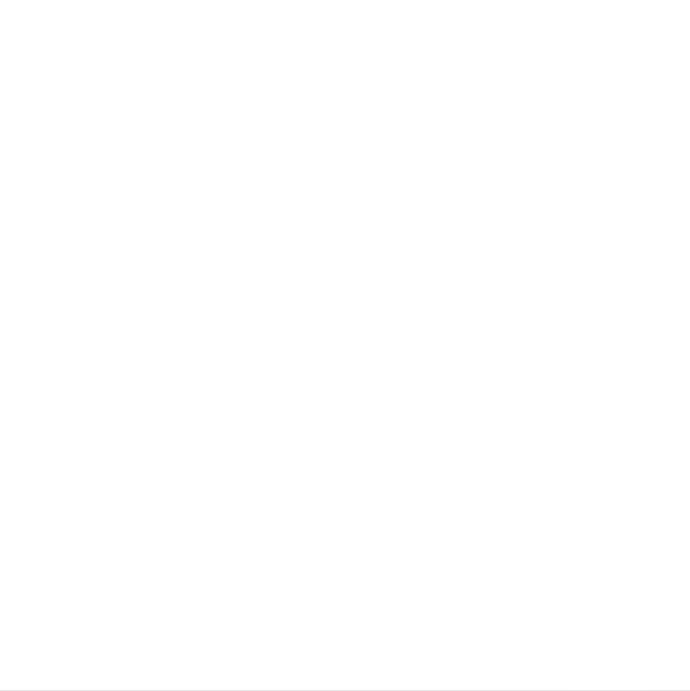
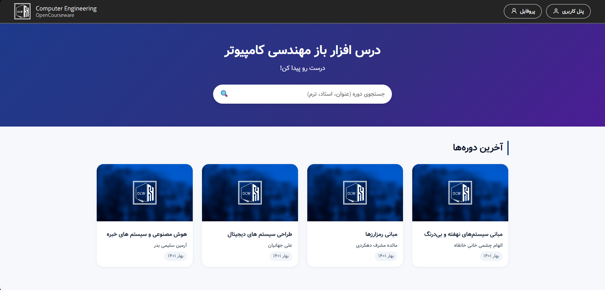
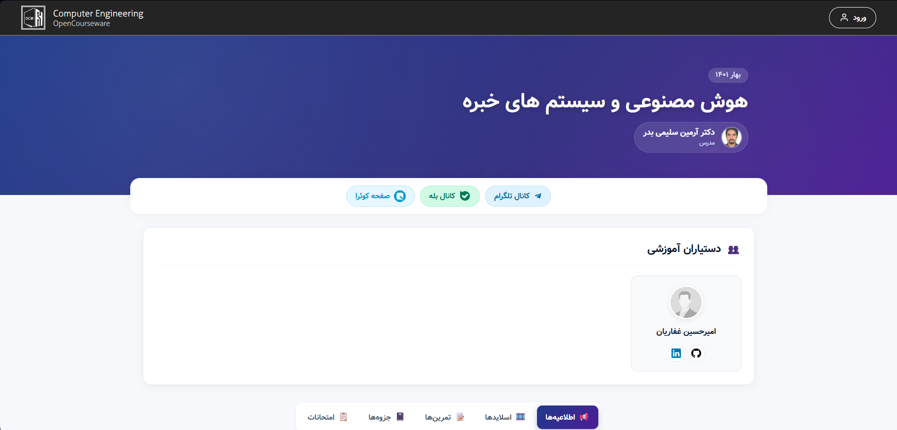

<div align="center">

<!-- TODO: replace with your logo -->


# CEOCW — Computer Engineering OpenCourseWare

A self-hosted course archive and management platform for publishing lecture slides, notes, assignments, exams, and announcements by semester and teacher.

[](https://go.dev/)
[](https://www.mysql.com/)
[](https://www.docker.com/)
[](LICENSE)

</div>

---

## Overview

CEOCW is a lightweight OpenCourseWare-style web application built for a computer engineering department. It lets staff publish and organize course material — slides, notes, assignments, exams, recordings, and announcements — grouped by course, teacher, and semester, and gives students a simple public catalog to browse and search.

It was originally built for [Shahid Beheshti University](https://cse.sbu.ac.ir), but the codebase has no hard dependency on that context and can be adapted for any department or institution.



## Features

- **Public course catalog** — browse courses by teacher or semester, view course pages, and search across the catalog
- **Course pages** — each course has slides, notes, assignments, exams, announcements, recordings, a schedule, a grading breakdown, a reading list, and TA info
- **Role-based access control** — four roles (`admin`, `head_ta`, `ta`, `normal`) with distinct permissions for managing courses, content, and users
- **Admin panel** — a dedicated dashboard for managing courses, teachers, semesters, books, TAs, and users
- **Authentication** — email/password login with hashed passwords (bcrypt) and persistent sessions
- **Jalali (Persian) calendar support** — built-in helpers for Jalali dates alongside the Gregorian calendar
- **Dockerized development environment** — one command spins up the app and a MySQL database together



## Tech Stack

| Layer            | Technology                                                                 |
|-------------------|-----------------------------------------------------------------------------|
| Language          | [Go](https://go.dev/) 1.21                                                  |
| Router            | [julienschmidt/httprouter](https://github.com/julienschmidt/httprouter)     |
| Middleware chain  | [justinas/alice](https://github.com/justinas/alice)                         |
| Sessions          | [alexedwards/scs](https://github.com/alexedwards/scs)                       |
| Database          | MySQL 8.0 (via [go-sql-driver/mysql](https://github.com/go-sql-driver/mysql)) |
| Auth              | [golang.org/x/crypto/bcrypt](https://pkg.go.dev/golang.org/x/crypto/bcrypt) |
| Templates         | Go's `html/template`                                                        |
| Frontend          | Server-rendered HTML, vanilla CSS/JS                                        |
| Containerization  | Docker & Docker Compose                                                     |

## Project Structure

```
.
├── cmd/web/          # Application entrypoint, routing, handlers, middleware
├── models/           # Database models (courses, users, teachers, semesters, etc.)
├── ui/
│   ├── html/          # Go html/template pages and partials
│   └── static/        # CSS, JS, fonts, icons, images
├── db/schema/         # Numbered SQL migration/seed files, run on first DB startup
├── tests/             # Test helpers
├── docker-compose.yml # App + MySQL development environment
└── Dockerfile
```

## Getting Started

### Prerequisites

- [Docker](https://docs.docker.com/get-docker/) and [Docker Compose](https://docs.docker.com/compose/) (recommended), **or**
- [Go](https://go.dev/dl/) 1.21+ and a running [MySQL](https://dev.mysql.com/downloads/) 8.0 instance

### Run with Docker (recommended)

This is the fastest way to get the app and database running together.

```bash
git clone https://github.com/<your-username>/ceocw.git
cd ceocw
docker compose up
```

This will:
1. Start a MySQL 8.0 container and automatically apply the schema files in `db/schema/`
2. Build and start the Go web server, reachable at **http://localhost:4000**

> An admin account is seeded automatically by `db/schema/014-admin-user.sql`. Check that file for the seeded email, and set/reset the password before deploying anywhere public.

### Run locally without Docker

1. Start a MySQL 8.0 server and create a database (e.g. `ceocw`).
2. Apply the schema files in order:
   ```bash
   for f in db/schema/*.sql; do
     mysql -u <user> -p ceocw < "$f"
   done
   ```
3. Run the app, pointing it at your database via the `-dsn` flag:
   ```bash
   go run ./cmd/web -addr=:4000 -dsn="<user>:<password>@/ceocw?parseTime=true"
   ```
4. Visit **http://localhost:4000**.

### Configuration

The app is configured via command-line flags:

| Flag    | Default                              | Description                          |
|---------|---------------------------------------|---------------------------------------|
| `-addr` | `:4000`                              | HTTP network address to listen on     |
| `-dsn`  | `amirh:pass@/ceocw?parseTime=true`   | MySQL data source name                |

## Running Tests

```bash
go test ./...
```

Tests spin up handlers against a local SQLite database for isolation — no external MySQL instance is required to run the test suite.

## Roles & Permissions

| Role      | Can do                                                                 |
|-----------|--------------------------------------------------------------------------|
| `normal`  | Browse public course pages, manage their own profile                    |
| `ta`      | Manage content (slides, notes, assignments, exams) for assigned courses |
| `head_ta` | Everything a `ta` can, plus edit course settings for assigned courses   |
| `admin`   | Full access: manage courses, teachers, semesters, users, and TAs        |

## Contributing

Contributions are welcome! Please open an issue to discuss significant changes before submitting a pull request.

1. Fork the repository
2. Create a feature branch (`git checkout -b feature/my-feature`)
3. Commit your changes
4. Push to the branch and open a pull request

## License


This project is licensed under the MIT License. See [LICENSE](LICENSE) for details.